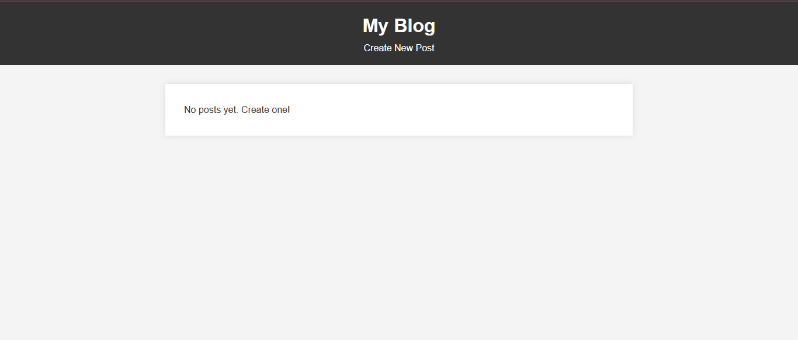
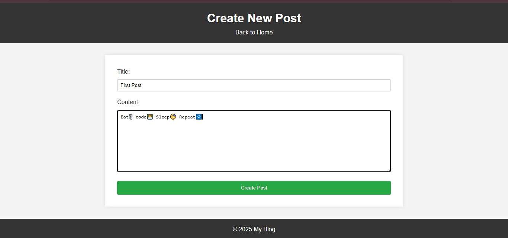
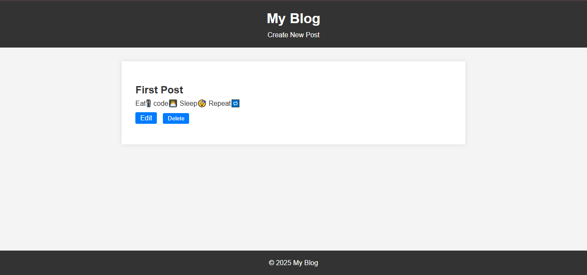

# Blog Web App 📝

A dynamic blog web application built using **Node.js**, **Express.js**, and **EJS** that allows users to create, view, edit, and delete posts with a modern, responsive UI.

---

## 🌟 Features

- **CRUD Operations:** Create, view, edit, and delete blog posts.
- **Responsive UI:** Seamless user experience on both desktop and mobile devices.
- **Rapid Prototyping:** Uses an in-memory data store (data resets on server restart).

---

## 🛠️ Technologies Used

- **Node.js** – JavaScript runtime environment.
- **Express.js** – Web framework for Node.js.
- **EJS** – Templating engine for dynamic HTML rendering.
- **CSS** – Styling for the user interface.

---

## 📂 Project Structure
```
blog-web-app/
├── app.js
├── package.json
├── views/
│   ├── index.ejs
│   ├── new.ejs
│   └── edit.ejs
└── public/
    └── css/
        └── styles.css
```

---

## 🔧 Setup & Usage

### 1️⃣ Clone the Repository:

```
git clone https://github.com/your-username/blog-web-app.git
cd blog-web-app
```

### 2️⃣ Install Dependencies:
```
npm install
```

### 3️⃣ Start the Application:
```
npm start
```
### 4️⃣ Open in Browser:

Open http://localhost:3000 in your web browser to view the app.

---

## 🎯 How It Works
1. Routing: Express.js handles all routes for post creation, viewing, updating, and deletion.
2. Templating: EJS dynamically renders HTML based on the application state.
3. Data Handling: Posts are stored in an in-memory array, enabling rapid prototyping without a database.
4. User Interaction: Intuitive forms and buttons allow seamless CRUD operations with real-time UI feedback.

---

## 👀Preview



---



---



---

## 📝 License
This project is open-source. Feel free to modify and improve it!

🚀 Happy Coding! ✨
